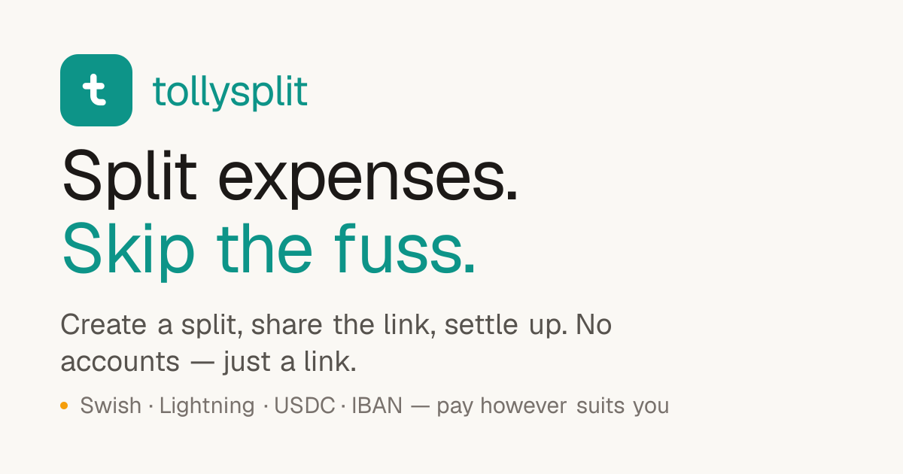

<div align="center">



# Xupersplit

**Split shared expenses without the fuss.** Create a split, share the link, and
let everyone add what they paid — balances and who-owes-whom are worked out
automatically, with one-tap payments straight from the balance view.

[**split.xuper.fun**](https://split.xuper.fun) · English · [Svenska](README.sv.md)

[](LICENSE)
&nbsp;Next.js 16 · Supabase · Tailwind v4 · wagmi/viem

<br />


</div>

---

## What it is

A clean, accountless expense splitter. The **secret link is the key** — anyone
with it can add expenses and settle up; no login required. Optional email
sign-in just makes your splits follow you across devices. Built as a one-prompt
project and grown from there.

## Features

- **No account needed.** The unguessable split link (122 bits of entropy) *is*
  the capability. Sign-in is optional.
- **Flexible splitting** — equal, weighted shares, or exact amounts, with cent
  rounding via the largest-remainder method.
- **Smart settlements** — the minimum set of "A pays B" transfers, with
  **partial payments** ("pay all or part") and strike-through once settled.
- **Don't settle too early** — see who has opened the split and who's marked
  themselves done; the pay dialog warns if someone hasn't weighed in yet.
- **Secure splits** *(optional, when signed in)* — bind participants to their
  accounts: you can only edit your own payment details and enter your own
  expenses. The creator picks who must log in, who can view, and how people join.
- **Multi-currency** — enter expenses in any currency with the rate **locked at
  save** (Kittysplit-style); set a main currency per split. Includes **sats** —
  run a whole split in bitcoin if you like.
- **Eight payment methods**, several with genuine one-tap prefill — [see below](#payments).
- **Six languages** — English, Svenska, Norsk, Dansk, Suomi, Íslenska
  (auto-detected, switchable).
- **Privacy by design** — payment details can be wiped once everyone is square,
  inactive splits are purged after 6 months, IP hashes deleted within a day,
  CSV/JSON export, full GDPR policy.
- **Dark / light / system** theme, cookie-less analytics, discreet cookie notice.

## Payments

Xupersplit stores each recipient's payment handle(s) and, wherever a payment
network exposes an **open, agreement-free** interface, turns the balance row
into a real one-tap payment — **prefilled with the exact amount**. No money ever
passes through Xupersplit; it only builds the link/invoice/transaction the payer
approves in their own app.

| Method | Experience | How |
| --- | --- | --- |
| **Swish** 🇸🇪 | QR + app deep link, amount prefilled | Public `app.swish.nu` link + QR endpoint — no merchant contract |
| **Lightning** ⚡ | QR + `lightning:` link, **exact amount baked in** | LNURL-pay (LUD-16): a lightning address → BOLT11 invoice |
| **Ethereum / USDC** Ξ | **One-tap prefilled USDC** transfer | WalletConnect (Reown AppKit) — connect, pick chain, approve |
| **Solana / USDC** ◎ | **One-tap prefilled USDC** SPL transfer | WalletConnect (Reown AppKit) — Phantom/Solflare, recipient ATA auto-created |
| **Ethereum / Solana address** | Address QR + copy, ENS resolved | `0x…` / `name.eth` / base58 — for any wallet |
| **Revolut** | Clickable `revolut.me` profile link | Opens the recipient's profile to pay |
| **Vipps · MobilePay · IBAN** | Stored handle + copy button | No open P2P API — the payer finishes in their own app |

**Why the difference?** Swish exposes a genuinely open prefilled deep link and
QR endpoint; Lightning's LNURL and EVM/Solana over WalletConnect are open
protocols. Vipps
and MobilePay (now Vipps MobilePay) only offer amount-prefilled flows through
their **merchant** APIs — a business agreement that routes money to a company,
not person-to-person — so for those Xupersplit does the honest thing and shows
the handle with a copy button. If they ever ship an open P2P deep link, wiring
it in is a small change. PRs welcome. 🤞

> **Crypto is irreversible.** Crypto methods show extra warnings, and **any**
> method warns (with a date) if the recipient's details were ever changed from
> what was first entered — anyone with the link can edit them.

## Architecture

- **No service-role key in the app.** All data access goes through
  `security definer` Postgres RPCs (`split_data`, `save_entry`,
  `set_payment_methods`, …) where the secret split key in the URL is the
  capability. RLS is deny-all on every table and direct grants are revoked — the
  client only ever holds the public publishable key. Schema and every change
  live in [`supabase/migrations/`](supabase/migrations).
- **Next.js App Router** + server actions; the client is plain React, no state
  library. Tailwind v4 with CSS-variable theming.
- **Thin, keyless API routes** proxy the open payment networks, all
  same-origin-locked: `/api/swish-qr`, `/api/ln-invoice` (LNURL-pay),
  `/api/ens` (viem), `/api/fx` (fiat + BTC, with provider fallback).
- **WalletConnect** is fully gated on a project id — absent, the EVM dialog
  cleanly falls back to QR + copy.
- **Privacy & abuse controls** — settle-time payment wipe (opt-out), 6-month
  purge of inactive splits, per-IP-hash + global create rate limits, and a
  daily job that flags split-key enumeration attempts.

## Tech stack

Next.js 16 · React 19 · TypeScript · Tailwind CSS v4 · Supabase (Postgres,
Auth) · wagmi + viem + @solana/web3.js + Reown AppKit · Playwright · Vercel

## Run it locally

```bash
npm install
cp .env.example .env.local   # add your own Supabase URL + anon key
npm run dev
```

`.env.local`:

```
NEXT_PUBLIC_SUPABASE_URL=https://<your-project>.supabase.co
NEXT_PUBLIC_SUPABASE_ANON_KEY=<your publishable key>
# Optional — enables the WalletConnect USDC flow (free id from cloud.reown.com)
NEXT_PUBLIC_REOWN_PROJECT_ID=<your reown project id>
```

## Deploy your own

Self-hostable on the free tiers of **Supabase + Vercel**.

1. **Supabase** — create a project (EU regions keep data in Europe), then apply
   the schema with `supabase link --project-ref <ref> && supabase db push`
   (runs every migration in [`supabase/migrations/`](supabase/migrations)).
   Grab the **Project URL** and **publishable (anon) key**. For optional email
   sign-in, configure SMTP and the `…/auth/confirm` redirect.
2. **Vercel** — import the repo, add `NEXT_PUBLIC_SUPABASE_URL` and
   `NEXT_PUBLIC_SUPABASE_ANON_KEY` (both safe to expose; security relies on RLS
   + RPCs). Add `NEXT_PUBLIC_REOWN_PROJECT_ID` too if you want WalletConnect.
   Deploy.
3. **Custom domain (optional)** — add it in Vercel, point a **DNS-only** CNAME
   to `cname.vercel-dns.com`, and add the domain's `…/auth/confirm` to the
   Supabase redirect allowlist if using email sign-in.

## Full self-host with Docker

Prefer to own the whole stack? [`selfhost/`](selfhost) brings up the app **and
its own backend** — Postgres, auth (GoTrue), the REST/RPC layer (PostgREST) and
a local mailbox — with no external services. The app itself acts as the gateway,
so the browser only ever talks to one origin.

```bash
cd selfhost
cp .env.example .env       # ⚠️ change the secrets — see the notes in the file
docker compose up -d --build
```

- App: **http://localhost:3000**. Sign in with **email + password** (works
  instantly, no SMTP needed) — or use the magic code, which lands in **Mailpit**
  at **http://localhost:8025**.
- **HTTPS** is one flag away: point a domain at the host, set `DOMAIN` +
  `ACME_EMAIL` and `SITE_URL=https://…` in `.env`, then
  `docker compose --profile tls up -d --build` — Caddy fetches and renews a
  Let's Encrypt certificate automatically. Behind NAT or want a wildcard cert?
  Set `CF_API_TOKEN` (a scoped Cloudflare token) and Caddy uses the DNS-01
  challenge instead — no port 80 exposure needed.
- The migrations in [`supabase/migrations/`](supabase/migrations) are applied
  automatically on first start.
- `.env.example` ships with **public demo** JWT keys so it runs out of the box.
  For anything internet-facing, change `JWT_SECRET` + the passwords and
  regenerate `ANON_KEY`/`SERVICE_ROLE_KEY` (any JWT tool works — sign
  `{"role":"anon",...}` / `{"role":"service_role",...}` with the new secret).
- Set `APP_PORT` / `MAILPIT_PORT` in `.env` to change host ports;
  `REOWN_PROJECT_ID` enables the WalletConnect pay buttons.

See **[`selfhost/README.md`](selfhost/README.md)** for the full guide —
secret regeneration, the gateway architecture, Cloudflare DNS-01, a config
reference and troubleshooting.

## Tests & CI

Playwright smoke tests (`npm run test:e2e`) run on every PR against a local
production build, gating merges to `main`; the pure split/balance/settlement
logic lives in `src/lib/money.ts`.

## Contributing

Issues and PRs welcome — especially a real open P2P deep link for Vipps or
MobilePay, or additional payment rails. The codebase is small and fully typed.

## License

MIT — see [LICENSE](LICENSE).

---

<div align="center">

If Xupersplit saved your group some bickering, you can

[](https://buymeacoffee.com/xuperfun)

*built with love, coffee and beer*

</div>
